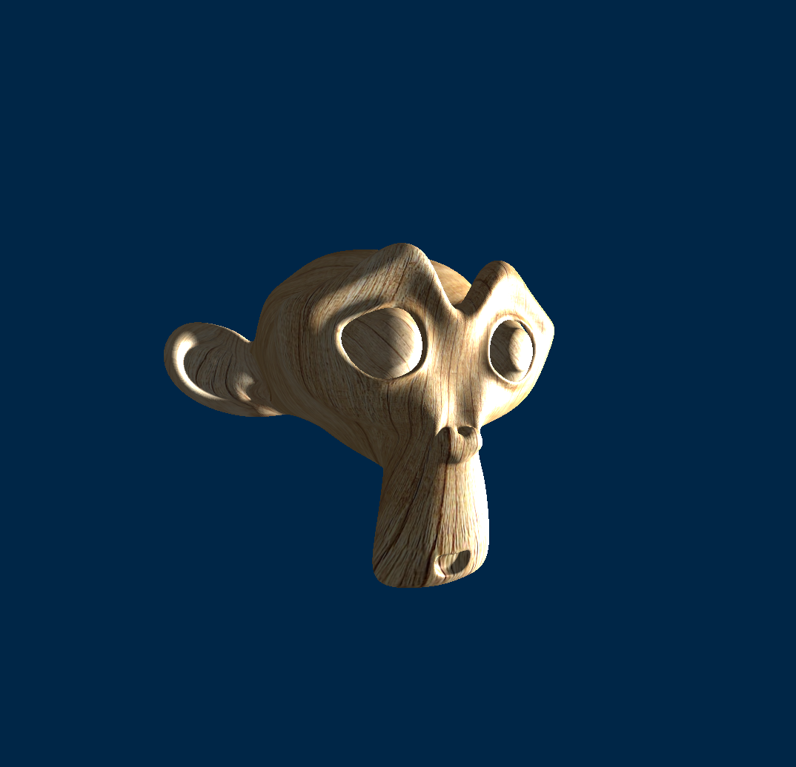
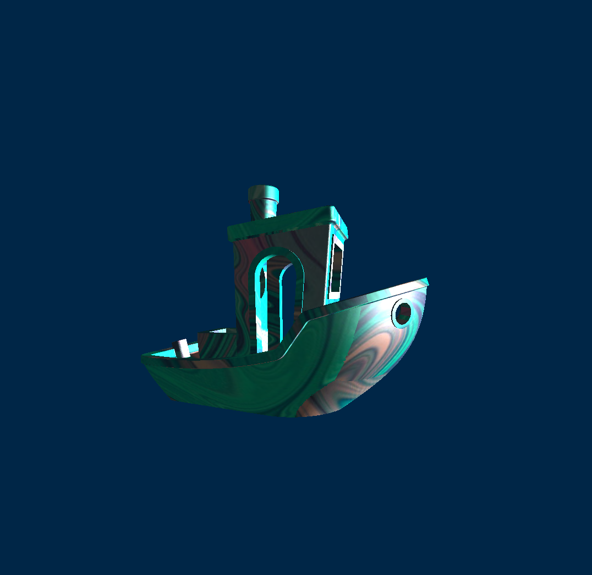
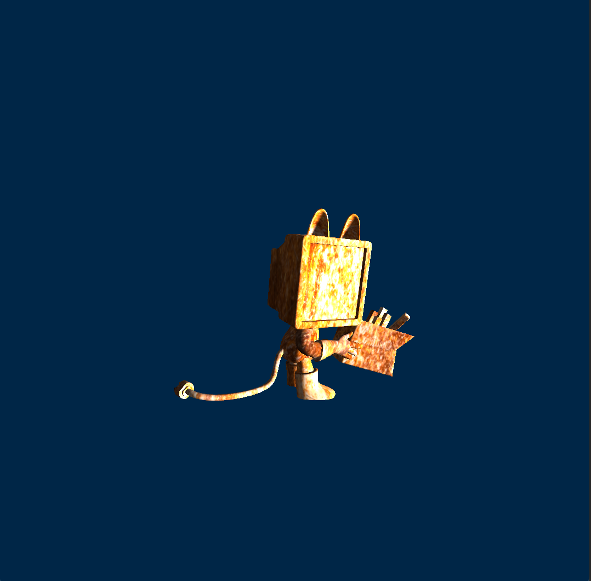

# Scop

Scop is a graphical project developed using Glium a wrapper OpenGL for rust, to display 3D objects loaded from .obj files.

## Features

-   Loading and displaying 3D objects in .obj format
-   Automatic object rotation around its main axis
-   Perspective rendering
-   Lighting models:
    -    Gouraud shading
    -    Blinn-Phong shading
-   Wireframe mode
-   Light and axis movement
-   Drag and drop for textures and .obj files
-   Facet coloration for distinction
-   Texture application with smooth transition

## Limitations

-   Supports only objects with a maximum of 4 vertices per face
-   Does not handle materials in .obj files
-   Limited handling of ambiguous .obj files

## Prerequisites

-   Rust and Cargo installed
-   OpenGL dependencies (check specific dependencies in Cargo.toml)

## Installation

```
    git clone https://github.com/jbettini/scop
    cd scop
    cargo run --release
```

## Screenshot 





